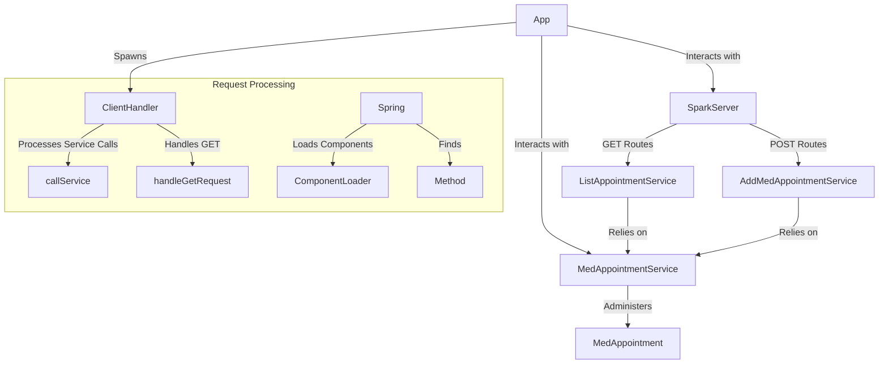

### Escuela Colombiana de Ingenieria - Julio Garavito
### Arquitectura Empresarial - AREP-LAB02
# WORKSHOP #3 - APPLICATION SERVER ARCHITECTURES, OBJECT META PROTOCOLS, IOC PATTERN, REFLECTION

## Name: Camilo Nicolas Murcia Espinosa

The objective of this workshop is to include new functionalities to our web server built during Workshop 1 and 2, so that it behaves like the Spring Boot framework and can use some annotations such as @RestController, @GetMapping and @RequestParam.

### Requirements 📋

* [Git](https://git-scm.com/) - Version control
* [Maven](https://maven.apache.org/) - Dependency manager
* [Java](https://www.oracle.com/java/technologies/downloads/#java17) - Programming language

> [!IMPORTANT]
> Git, Maven and Java 17 must be installed to run the project.


## Installation and Execution
The first step is to install Git and Maven on your computer, and after that, clone the repository from the terminal as follows:
```
git clone https://github.com/CamiloMurcia28/AREP-Taller03.git
```
Next, navigate to the resulting folder and execute the following Maven commands:
```
mvn clean install
```

Then, enter the final command to run the server:
```
java -cp target/classes escuelaing.edu.co.arep.App
```


Or you can use the next command for a faster execution: 

```bash
mvn clean compile exec:java '-Dexec.mainClass=edu.eci.arep.App'
```

The above command will clean up previous builds, compile and then run the application.


Finally, access the web application from a browser at [localhost:35000/pagina.html]() to interact with it.

## Architecture
The system is built on a Client-Server architecture, where the server is responsible for hosting all the necessary resources within a directory specified by the developer. Clients, which can be one or more users or applications, interact with the server by making requests to access and utilize these resources. The server processes these requests using lambda functions and RESTful web services implemented on the backend, ensuring that the resources are served efficiently and responsively to the clients.

* **MedAppoController**: Handles incoming requests through methods annotated with @RequestMapping and @GetMapping. These methods respond to specific requests and can use query parameters.
* **RESTService**: This is an interface that defines the response method, which will be implemented by the services that define the business rules.
* **AddExerciseService and ListExerciseService**: RESTService implementations that handle the logic for adding exercises and listing exercises (more specifically, a new method was added to this service that returns a Json with the suggested exercises).
* **ClientHandler**: This component handles client connections. It listens for HTTP requests, processes them, and returns responses. It also handles static file management when a GET request is received.
* **ComponentLoader**: This component searches for and loads classes annotated with @RestController in the specified package, allowing automatic controller detection.
* **SparkServer**: Contains the implementation of the web microframework.
* **SpringServer**: Contains the implementation to load the components and listeners.

### Diagram

## Running the tests ⚙️

To run the tests, run the following command:

```bash
mvn test

```

In the tests we will be testing the functionalities such as server response, web requests, operation of both Spark and Spring

## Evaluation

A view of the App:


